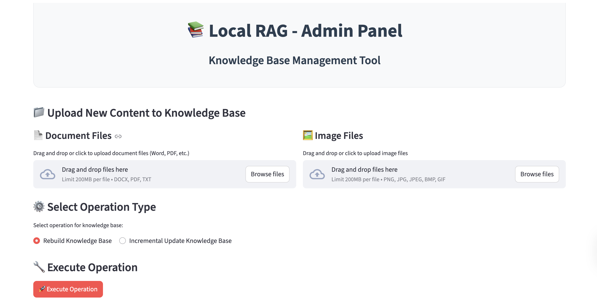
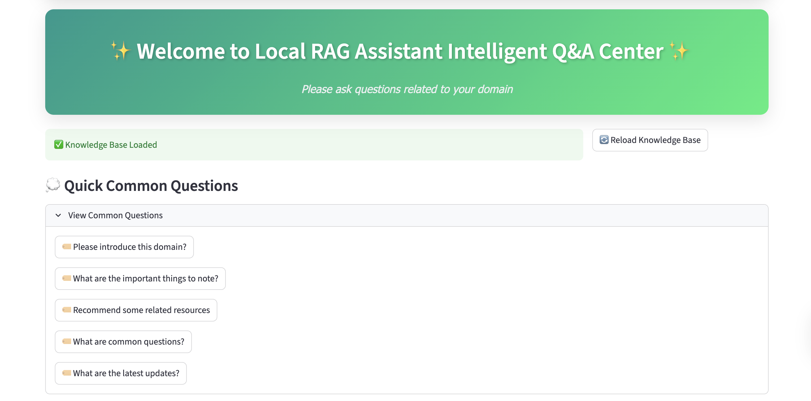
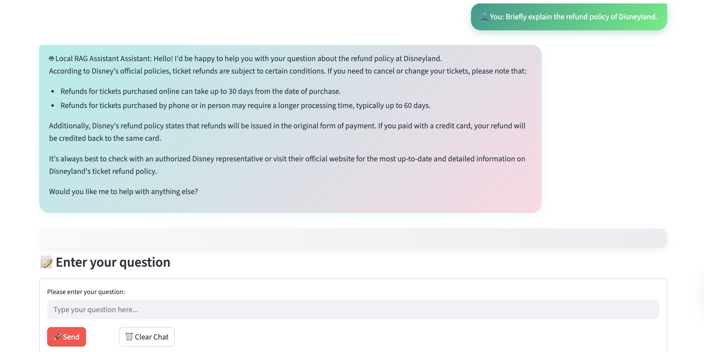

# Multi-model RAG Knowledge Base Builder

[](https://www.python.org/)
[](https://streamlit.io/)
[](https://pytorch.org/)
[](https://huggingface.co/)
[](https://ollama.ai/)
[](https://github.com/facebookresearch/faiss)

A universal local RAG (Retrieval-Augmented Generation) knowledge base building system that allows you to create and manage knowledge bases for any domain.

## Features

- **Multi-format Document Support**: Word (.docx), PDF (.pdf), TXT (.txt)
- **Image Knowledge Base**: Support for image-based knowledge with OCR capabilities
- **Multimodal Retrieval**: Combined text and image search capabilities
- **Dual Interface Design**: Separate admin and user interfaces for better UX
- **Drag & Drop Upload**: Intuitive file upload experience
- **Incremental Updates**: Add new content without rebuilding entire knowledge base
- **Real-time Statistics**: Live monitoring of knowledge base metrics

## Tech Stack

- **Frontend**: [Streamlit](https://streamlit.io/) for responsive web interfaces
- **Backend**: Python 3.8+ with modern ML libraries
- **Vector Search**: [FAISS](https://github.com/facebookresearch/faiss) for efficient similarity search
- **Embeddings**: [Sentence Transformers](https://www.sbert.net/) and [CLIP](https://openai.com/research/clip) models
- **OCR**: [PaddleOCR](https://github.com/PaddlePaddle/PaddleOCR) for image text extraction
- **LLM**: [Ollama](https://ollama.ai/) for local inference
- **Storage**: Local file system with JSON metadata

## Architecture Overview

The system follows a dual-interface architecture with separate concerns:

### Admin Interface (Port 8502)
- **Knowledge Base Management**: Upload documents and images
- **Content Processing**: Convert files to vector representations
- **Storage Management**: Build and update FAISS vector databases

### User Interface (Port 8501)  
- **Chat Experience**: Interactive question-answering interface
- **RAG Engine**: Retrieve relevant context and generate responses
- **Real-time Statistics**: Display knowledge base metrics

### Core Components Flow
```
┌─────────────────┐    ┌────────────────────┐    ┌─────────────────┐
│   Admin Panel   │───▶│ Knowledge Base    │───▶│  Vector Store   │
│ (Upload Files)  │    │  (Process Files)   │    │   (FAISS DB)    │
└─────────────────┘    └────────────────────┘    └─────────────────┘
                                 ▲                          │
                                 │                          │
┌─────────────────┐    ┌────────┴────────┐    ┌────────────▼─────────┐
│   User Chat     │───▶│   RAG Engine    │───▶│   Local LLM         │
│  (Questions)    │    │ (Retrieve & Gen)│    │  (Ollama/Llama3.2)   │
└─────────────────┘    └─────────────────┘    └──────────────────────┘
```

## Pre-built Content Notice

The pre-built knowledge base is based on some documents related to Disney. Therefore, when using the chat-bot for the first time, try to ask questions about the theme park, such as:
- "What are the ticket rules for Shanghai Disneyland?"
- "What are the elderly discount policies?"
- "Recommend some Disney travel guides"
- "What are the hotel membership systems?"
- "What special events are there during Halloween?"

To customize the knowledge base for your own domain, use the Admin Interface to upload your documents and rebuild the knowledge base.

## Getting Started

### Prerequisites

- Python 3.8 or higher
- [Ollama](https://ollama.ai/) installed locally
- Required Python packages: `pip install -r requirements.txt`

### Installation

1. Clone the repository:
```bash
git clone https://github.com/monodara/RAG-build-it-yourself.git
cd RAG-build-it-yourself
```

2. Install dependencies:
```bash
pip install -r requirements.txt
```

3. Configure environment variables:
```bash
cp .env.example .env
# Edit .env file with your preferred settings
```

### Running the Application

#### Start Admin Interface (Port 8502)
The admin interface is used for building and managing knowledge bases.

```bash
streamlit run admin_interface/admin_manager.py --server.port 8502
```


*Admin interface showing file upload areas and knowledge base management tools*

#### Start User Interface (Port 8501)
The user interface provides the chat experience with the knowledge base.

```bash
streamlit run user_interface/main.py
```



*User chat interface with conversation history and quick question suggestions*

## Usage Workflow
### Admin

1. **Build Knowledge Base**: Use the admin interface (port 8502) to upload documents and images
2. **Choose Operation**: Select between rebuilding or incrementally updating the knowledge base
3. **Execute**: Click "Execute Operation" to process your content
### User
1. **Interact**: Visit user interface (port 8501) to chat with the knowledge base
2. **Update**: Reload the knowledge base after Admin rebuilding or updating it.

## Supported Document Formats

### Text Documents
- Microsoft Word: `.docx`
- Portable Document Format: `.pdf`
- Plain Text: `.txt`

### Images
- PNG: `.png`
- JPEG: `.jpg`, `.jpeg`
- Bitmap: `.bmp`
- Graphics Interchange Format: `.gif`

## Configuration

Customize the system through environment variables:

```bash
# Knowledge base paths
DOCS_DIR=knowledge_base
DATA_DIR=data

# Model configuration
TEXT_EMBEDDING_MODEL=all-MiniLM-L6-v2
CLIP_MODEL_NAME=openai/clip-vit-base-patch32

# Ollama settings
OLLAMA_MODEL=llama3.2:3b
OLLAMA_TEMPERATURE=0.3

# System identity
SYSTEM_NAME=Local RAG Assistant
SYSTEM_ROLE=You are a professional assistant
```

## System Limitations

While this system provides powerful local RAG capabilities, there are several important limitations to consider:

### Performance Constraints

- **Slow Vectorization Process**: Using local offline models for embedding generation is significantly slower than cloud-based solutions
- **Limited Accuracy**: Small local models provide lower accuracy compared to larger hosted models
- **Resource Intensive**: Model loading and inference consume considerable CPU/memory resources
- **Response Time**: Answer generation can be slow due to local processing constraints

### Model Limitations

- **Model Size vs Quality Trade-off**: The project uses smaller models (like all-MiniLM-L6-v2) to enable local execution, which compromises accuracy
- **Hardware Dependencies**: Performance varies greatly depending on available hardware (CPU vs MPS acceleration)
- **Memory Constraints**: Large knowledge bases may exceed available memory on resource-limited systems

### Scalability Issues

- **Single Machine Limitation**: Currently designed for single-machine deployment only
- **Concurrent Users**: Limited support for multiple simultaneous users
- **Large Document Processing**: May struggle with very large documents or datasets

### Recommendation

For production environments requiring high performance and accuracy, consider:
- Using more powerful cloud-based models
- Implementing GPU acceleration where available
- Optimizing vector database indexing strategies
- Implementing caching mechanisms for frequently accessed content

## Contributing

Contributions are welcome! Please feel free to submit a Pull Request.
